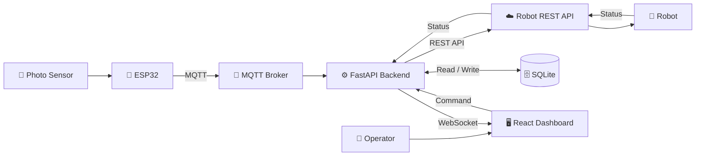

  

---

## 👨‍💻 About Me

I'm a **Robot Integration Engineer** from Thailand 🇹🇭, working with industrial robots, backend systems, automation, and network infrastructure.

My work focuses on connecting **robots ↔ APIs ↔ servers ↔ industrial equipment** and building tools for robot monitoring, control, and task dispatch.

## 🏗️ System Architecture

---

<h2>🧩 Engineering Stack</h2>

<h3>🤖 Robotics & Automation</h3>

 

  

<h3>⚡ Software & Backend</h3>

 

 

  

<h3>🌐 Network & Infrastructure</h3>

 

 

  

---

## 🚀 Featured Projects

### 🤖 Robot Factory Dispatch System

Industrial robot dispatch and fleet management system designed for factory environments. Supports multi-robot task assignment, job queues, robot availability, real-time status updates, and physical dispatch stations.

 

### 🔗 Robot OpenAPI Integration

Backend integration layer for connecting robot platforms with custom applications, including authentication, robot status, task creation, task cancellation, mission tracking, and telemetry.

 

### 📡 ESP32 Industrial Sensor & Dispatch System

ESP32-based interface for industrial photo sensors and physical dispatch controls. Sensor states are processed by the controller and transmitted to backend systems through MQTT for automation and robot task triggering.

 

### 🌐 Robot Network & Infrastructure

Network infrastructure and troubleshooting for robot systems, servers, and industrial devices, including static IP configuration, DHCP reservation, LAN deployment, VLAN, Wi-Fi access points, and network diagnostics.

 

### 📊 Robot Monitoring Dashboard

Real-time web dashboard for monitoring robot status, missions, locations, connected equipment, sensor states, and system events from a centralized interface.

 

---

## 🔧 What I Work On

  
<pre>
🤖 Robot Integration       ⚡ Backend Development
🚚 Fleet Management        📡 MQTT / REST API
🌐 Network Infrastructure  🐧 Linux Server
🔌 Industrial Equipment    📟 ESP32 / Sensors
</pre>

---

### ⚙️ Robots. Software. Networks.

 

---

## 🛠️ Demos & Implementations

Below are some **demo projects, prototypes, and system implementations** I have developed and deployed in real-world environments, covering robotics, automation, IoT, and software systems.

